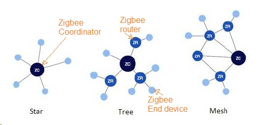
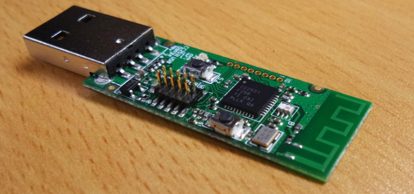
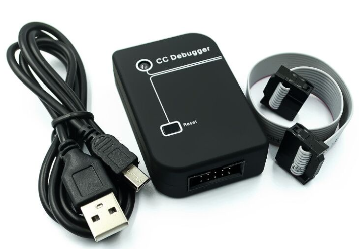
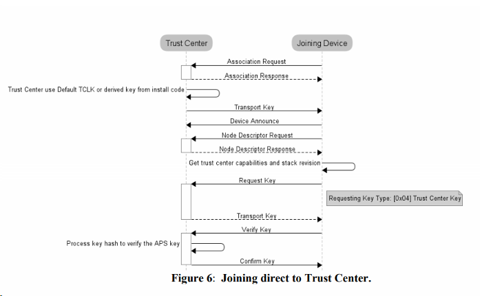
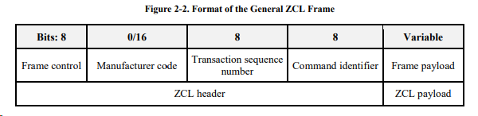

 * **Project:** ***HAGateway-Zigbee***
 * **File Created:**  09 August 2022 03:23:56
 * **Author:** KhangKT
 * **AuthorEmail:** *khangkieutrong@gmail.com*
 * **Phone:** *0964991713*

### I. Introduce
####  Reference:
- **Zigbee Cluster Library :** *https://zigbeealliance.org/wp-content/uploads/2019/12/07-5123-06-zigbee-cluster-library-specification.pdf*
- **Setup Sniffer Tool :** *https://e2e.ti.com/support/wireless-connectivity/zigbee-thread-group/zigbee-and-thread/f/zigbee-thread-forum/699648/faq-zigbee-packet-sniffing-solutions?tisearch=e2e-sitesearch&keymatch=faq%3Atrue* 
- **Documents :** *Texas Instruments\Z-Stack 3.0.2\Documents* 
#### Zigbee Network Module:


### II. Zigbee Coordinator
#### 1. HardWare:
- CC2531 USB Dongle. 

- CC Debugger.

- CC2531+Firmware Sniffer.
#### 2. Applycation :
- **SmartRF Flash Programmer:** *https://www.ti.com/tool/FLASH-PROGRAMMER*
- **Zstack 3.0.2:** *https://www.ti.com/tool/Z-STACK*
- **WireShark note 3.0:** *https://www.wireshark.org/* 
  > Please refer *Setup Sniffer Tool* above.
- **Z-tool 2.0** 
#### **3. Use ZTool+Z-Stack 3.0 ZNP to setup basic Zigbee 3.0 network :**
  > Refer: *https://sunmaysky.blogspot.com/2017/02/use-ztool-z-stack-30-znp-to-set-up.html*



###### **Note:** Device send ZDO_LEAVE_IND after ZDO_MGMT_PERMIT_JOIN_REQ.
> Please send APP_CNF_BDB_SET_TC_REQUIRE_KEY_EXCHANGE with false parameter and enable permit join to allow device to join again.

#### **4. Build Coordinator by Serial Command:**
- Setup Ubutu Enviroment. 
- Open Serial Port.
  Note: Serial port configuration 
  ```C++
  static int Serial_Set(int fd, int speed, int parity)
  {
    struct termios tty;
    memset(&tty, 0, sizeof tty);
    if (tcgetattr(fd, &tty) != 0)
    {
        return -1;
    }
    cfsetospeed(&tty, speed);
    cfsetispeed(&tty, speed);
    tty.c_cflag = (tty.c_cflag & ~CSIZE) | CS8; // 8-bit chars
    // disable IGNBRK for mismatched speed tests; otherwise receive break
    // as \000 chars
    tty.c_iflag &= ~IGNBRK; // disable break processing
    tty.c_lflag = 0;        // no signaling chars, no echo,
    // / setup for non-canonical mode /
    tty.c_iflag &= ~(IGNBRK | BRKINT | PARMRK | ISTRIP | INLCR | IGNCR | ICRNL | IXON);
    tty.c_lflag &= ~(ECHO | ECHONL | ICANON | ISIG | IEXTEN);
    tty.c_oflag &= ~OPOST;
    tty.c_oflag = 0;     // no remapping, no delays
    tty.c_cc[VMIN] = 0;  // read doesn't block
    tty.c_cc[VTIME] = 5; // 0.5 seconds read timeout
    tty.c_iflag &= ~(IXON | IXOFF | IXANY); // shut off xon/xoff ctrl
    tty.c_cflag |= (CLOCAL | CREAD);   // ignore modem controls,
                                       // enable reading
    tty.c_cflag &= ~(PARENB | PARODD); // shut off parity
    tty.c_cflag |= parity;
    tty.c_cflag &= ~CSTOPB;
    tty.c_cflag &= ~CRTSCTS;
    if (tcsetattr(fd, TCSANOW, &tty) != 0)
    {
        return -1;
    }
    return 0;
  }
  ```
- Send Serial Command.
- Receive packet response.
 > Using multithread

#### **5. Decrypt packet:**
 Refer:
>  C:\Texas Instruments\Z-Stack 3.0.2\Documents\API\Z-Stack Monitor and Test API.pdf
>  IEEE Address: https://www.wireshark.org/tools/oui-lookup.html

Frame Control Field:


### III. Note 
**Some common mistakes:**
- Lost firmware cc debuger: *https://www.ti.com/lit/ug/swru197h/swru197h.pdf?ts=1656928177212&ref_url=https%253A%252F%252Fwww.google.com%252F*
  

